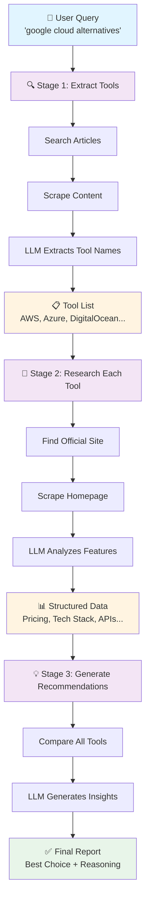

# 🔍 CodeScout - AI-Powered Developer Tools Research Agent

<div align="center">
  
  <p><i>Automatically discover, analyze, and compare developer tools using AI</i></p>
</div>

---

## 🎯 What is CodeScout?

CodeScout is an intelligent research agent that helps developers find the best tools for their needs. It uses AI-powered web scraping to search, analyze, and compare developer tools, libraries, and platforms automatically.

### Key Features

- 🤖 **Automated Research** - Searches and scrapes relevant articles about developer tools
- 🧠 **AI-Powered Analysis** - Extracts pricing, tech stack, and language support using LLM
- 📊 **Smart Comparison** - Compares multiple tools side-by-side
- ⚡ **Fast Results** - Powered by Groq's ultra-fast LLM infrastructure

---

## 🏗️ How It Works



### The Workflow Explained

1. **Extract Tools** - Searches articles, scrapes content, and identifies relevant tool names
2. **Research Tools** - For each tool: finds official site, scrapes data, and analyzes features
3. **Generate Recommendations** - Compares all tools and provides best choice with reasoning

---

## 🚀 Quick Start

### Prerequisites

- Python 3.10+
- [Firecrawl API Key](https://firecrawl.dev/)
- [Groq API Key](https://console.groq.com/)

### Installation

1. **Clone the repository**
   ```bash
   git clone https://github.com/yourusername/codescout.git
   cd codescout
   ```

2. **Install dependencies**
   ```bash
   uv venv
   source .venv/bin/activate  # Windows: .venv\Scripts\activate
   uv pip install -r requirements.txt
   ```

3. **Set up environment variables**

   Create a `.env` file:
   ```env
   FIRECRAWL_API_KEY=your_firecrawl_key_here
   GROQ_API_KEY=your_groq_key_here
   ```

4. **Run the agent**
   ```bash
   uv run main.py
   ```

---

## 💻 Usage Example

```bash
Developer Tools Research Agent

🔍 Developer Tools Query: google cloud alternatives

📊 Results for: google cloud alternatives
============================================================

1. 🏢 AWS (Amazon Web Services)
   🌐 Website: https://aws.amazon.com
   💰 Pricing: Pay-as-you-go
   📖 Open Source: False
   🛠️  Tech Stack: EC2, S3, Lambda, RDS, DynamoDB
   💻 Language Support: Python, Java, Node.js, Go, .NET
   🔌 API: ✅ Available
   🔗 Integrations: GitHub, Docker, Kubernetes, Terraform

2. 🏢 DigitalOcean
   🌐 Website: https://www.digitalocean.com
   💰 Pricing: Freemium ($5/month starting)
   📖 Open Source: False
   🛠️  Tech Stack: Droplets, Kubernetes, App Platform
   💻 Language Support: Python, Node.js, PHP, Ruby, Go
   🔌 API: ✅ Available

Developer Recommendations:
----------------------------------------
**Alternative to Google Cloud: Amazon Web Services (AWS)**
Best tool: AWS is the most comprehensive alternative to Google Cloud, offering a wide range of services including computing, storage, databases, analytics, machine learning, and more.
Key cost/pricing consideration: AWS pricing is generally competitive with Google Cloud, with a pay-as-you-go model that can help reduce costs.
Main technical advantage: AWS has a vast ecosystem of services and tools, making it easier to integrate and manage complex applications.
```

---

## 📦 Project Structure

```
codescout/
├── main.py                    # Entry point with CLI interface
├── src/
│   ├── config/
│   │   ├── settings.py        # Environment configuration
│   │   ├── schemas.py         # Pydantic models
│   │   ├── prompts.py         # LLM prompts
│   │   └── logging.py         # Logging setup
│   └── utils/
│       ├── workflow.py        # LangGraph workflow
│       ├── firecrawl.py       # Web scraping service
│       └── llm.py             # Groq LLM integration
├── requirements.txt
└── .env
```

---

## 🔧 Configuration

### Customize Number of Results

In `workflow.py`:
```python
# Number of articles to scrape
search_results = self.firecrawl.search_companies(query, num_results=3)

# Number of tools to research
tool_names = extracted_tools[:4]
```

### Change LLM Model

In `src/utils/llm.py`:
```python
model = "llama-3.1-8b-instant"
# Other options: llama-3.1-70b-versatile, mixtral-8x7b-32768
```

---

## 🎨 Tech Stack

- **[LangGraph](https://github.com/langchain-ai/langgraph)** - Multi-agent workflow orchestration
- **[Groq](https://groq.com/)** - Ultra-fast LLM inference
- **[Firecrawl](https://firecrawl.dev/)** - Web scraping with markdown output
- **[Pydantic](https://docs.pydantic.dev/)** - Type-safe data validation
- **[LangChain](https://www.langchain.com/)** - LLM framework

---

## 🤝 Contributing

Contributions are welcome! Feel free to submit a Pull Request.

---

<div align="center">
  <strong>⭐ If you find this project useful, please star it!</strong>
</div>